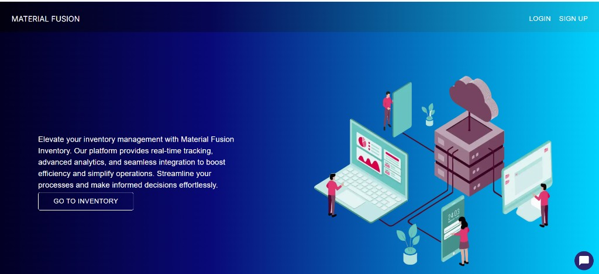
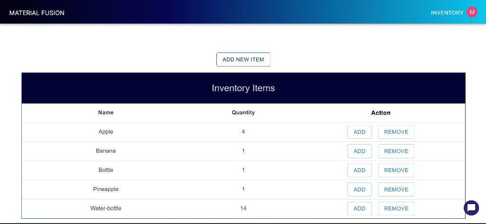
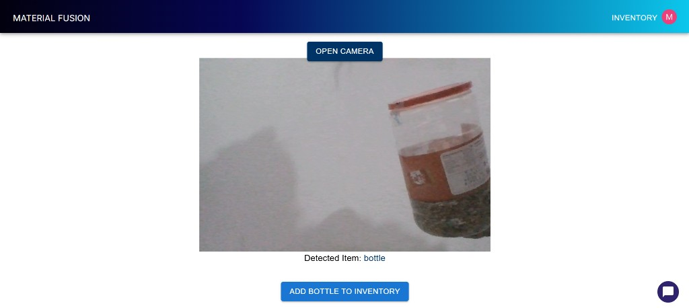

# Material Fusion

A full-stack **inventory management web application** with **real-time image classification**. Users can manually track stock or open the device camera, capture an item, and have it automatically classified and added to inventory.

**Live Demo:** [material-fusion.vercel.app](https://material-fusion.vercel.app)

---

## Features

- **Inventory Management** — Add, remove, and view item quantities in real time
- **Real-Time Image Classification** — Open the camera, take a photo, and auto-detect the item
- **One-Click Stock Updates** — Detected labels map directly to inventory entries
- **User Authentication** — Secure sign-in/sign-up with Clerk
- **AI Inventory Assistant** — Groq-powered chatbot for inventory help and recipe suggestions
- **Cloud Storage** — Inventory synced with Firebase Firestore

---

## Computer Vision & Image Classification

This app uses a **camera-first workflow** for hands-free inventory updates.

### How It Works

1. **Open Camera** — The `/cameraimage` page uses `react-camera-pro` to access the device webcam in the browser
2. **Capture Photo** — User clicks **Take Photo**; the frame is saved as a base64 image
3. **Send to Classifier** — The image is posted to the Next.js API route `/api/classify`
4. **Roboflow Inference** — The backend forwards the image to a **Roboflow Serverless Workflow** for object classification
5. **Display Result** — The top predicted label (e.g. `bottle`, `banana`, `apple`) is shown on screen
6. **Add to Inventory** — User confirms with **Add [item] to Inventory**, which increments the count in Firebase

### Classification Pipeline

```
Camera (browser) → Base64 snapshot → /api/classify → Roboflow Workflow API → Top label → Firebase Firestore
```

### Model & API Details

| Component | Technology |
|-----------|------------|
| Camera capture | `react-camera-pro` (live webcam feed) |
| Image format | Base64-encoded JPEG from camera snapshot |
| Classification API | [Roboflow Serverless Workflows](https://roboflow.com/) |
| Inference endpoint | `serverless.roboflow.com/infer/workflows/{workspace}/{workflow_id}` |
| Output | Top predicted class label used as inventory item name |

The Roboflow workflow is trained for **custom inventory object classes** (e.g. bottles, fruits, everyday items). Earlier versions of the project also explored **Azure Custom Vision** and **Hugging Face ResNet-50** for image classification; the current production path uses Roboflow workflows for faster, serverless inference.

### Key Files

| File | Purpose |
|------|---------|
| `app/cameraimage/page.js` | Camera UI — open webcam, capture photo, trigger classification |
| `app/component/APIcomponent.js` | Sends captured image to classifier and displays detected label |
| `app/api/classify/route.js` | Server-side Roboflow API proxy (keeps API keys secure) |
| `app/inventory/page.js` | Inventory table and auto-add from detected item name |

---

## Screenshots

### Landing Page



### Inventory Dashboard



### Real-Time Camera Classification

Open the camera, capture an item, and the model classifies it instantly — then add it to inventory with one click.



---

## Tech Stack

| Layer | Technology |
|-------|------------|
| Frontend | Next.js 14, React, Material UI |
| Authentication | Clerk |
| Database | Firebase Firestore |
| Computer Vision | Roboflow Serverless Workflows |
| Camera | react-camera-pro |
| AI Chatbot | Groq (Llama 3) |
| Deployment | Vercel |

---

## Project Structure

```
material-fusion/
├── app/
│   ├── api/
│   │   ├── classify/route.js      # Roboflow image classification proxy
│   │   └── chat_api/route.js      # Groq inventory chatbot
│   ├── cameraimage/page.js        # Real-time camera capture page
│   ├── inventory/page.js          # Inventory management UI
│   ├── component/
│   │   ├── APIcomponent.js        # Classification result display
│   │   ├── Chat.jsx               # AI chat widget
│   │   └── Header.js
│   ├── sign-in/                   # Clerk auth pages
│   └── sign-up/
├── firebase.js                    # Firestore configuration
├── middleware.js                  # Clerk middleware
└── public/
```

---

## Setup

### 1. Clone the Repository

```bash
git clone https://github.com/0xfatima/material-fusion.git
cd material-fusion
```

### 2. Install Dependencies

```bash
npm install
```

### 3. Environment Variables

Create a `.env.local` file in the project root:

```env
# Firebase
FIREBASE_API_KEY=your_firebase_api_key

# Clerk Authentication
NEXT_PUBLIC_CLERK_PUBLISHABLE_KEY=your_clerk_publishable_key
CLERK_SECRET_KEY=your_clerk_secret_key

# Roboflow (Image Classification)
ROBOFLOW_API_KEY=your_roboflow_api_key
WORKSPACE=your_roboflow_workspace
WORKFLOW_ID=your_roboflow_workflow_id

# Groq (AI Chatbot)
GROQ_API_KEY=your_groq_api_key
```

### 4. Run the Development Server

```bash
npm run dev
```

Open [http://localhost:3000](http://localhost:3000) in your browser.

---

## Usage

1. **Sign up / Log in** via Clerk
2. Go to **Inventory** to view or manually manage items
3. Click **Add New Item → Camera** (or navigate to `/cameraimage`)
4. Click **Open Camera**, point at an object, and press **Take Photo**
5. Wait for the detected label, then click **Add [item] to Inventory**

---

## About

Material Fusion combines traditional inventory tracking with **computer vision** so users can update stock by simply photographing items — no manual typing required.
